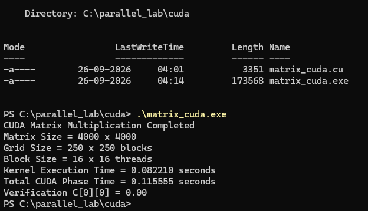

# Experiment 1 – Matrix Multiplication

## Parallel and GPU Computing

This experiment implements matrix multiplication using four different
parallel computing approaches:

1. Sequential Matrix Multiplication
2. OpenMP Matrix Multiplication
3. MPI Distributed Matrix Multiplication
4. CUDA GPU Matrix Multiplication

The same 4000 × 4000 matrix multiplication problem is used for all
implementations to compare their execution performance.

---

## Problem Definition

Two matrices A and B of size 4000 × 4000 are initialized with all
elements equal to 1.0.

The multiplication is:

C = A × B

Since every element of A and B is 1.0:

C[i][j] = 4000.00

Therefore, the expected verification value is:

C[0][0] = 4000.00

---

# 1. Sequential Matrix Multiplication

### Computing Model

The sequential implementation performs matrix multiplication using a
single CPU execution flow.

### Implementation

- Matrix size: 4000 × 4000
- Execution model: Sequential CPU
- Language: C
- Compiler: GCC

### Result


### Recorded Result

| Parameter | Result |
|---|---:|
| Matrix Size | 4000 × 4000 |
| Execution Time | 244.120000 s |
| Verification C[0][0] | 4000.00 |

---

# 2. OpenMP Matrix Multiplication

### Computing Model

OpenMP parallelizes the outer matrix multiplication loop using multiple
threads sharing the same memory space.

### Configuration

- Matrix size: 4000 × 4000
- OpenMP threads: 8
- Shared-memory CPU execution
- Compiler: GCC
- Compilation flag: `-fopenmp`

### Result


### Recorded Result

| Parameter | Result |
|---|---:|
| Matrix Size | 4000 × 4000 |
| Threads | 8 |
| Execution Time | 30.830434 s |
| Verification C[0][0] | 4000.00 |

---

# 3. MPI Distributed Matrix Multiplication

### Computing Model

MPI distributes the matrix computation across multiple processes.
The 4000 rows are divided between four MPI processes.

### Configuration

- Matrix size: 4000 × 4000
- MPI processes: 4
- Master + 3 Worker nodes
- Each process computes 1000 rows
- MPI operations used:
  - `MPI_Scatter`
  - `MPI_Bcast`
  - `MPI_Gather`

### Result


### Recorded Result

| Parameter | Result |
|---|---:|
| Matrix Size | 4000 × 4000 |
| MPI Processes | 4 |
| Execution Time | 92.979510 s |
| Verification C[0][0] | 4000.00 |

---

# 4. CUDA Matrix Multiplication

### Computing Model

CUDA offloads the matrix multiplication to an NVIDIA GPU.

Each CUDA thread calculates one output element of matrix C.

### GPU Configuration

- GPU: NVIDIA GeForce RTX 5060 Ti
- GPU Memory: ~16 GB
- CUDA Toolkit: 13.4
- Matrix size: 4000 × 4000
- Block size: 16 × 16 threads
- Grid size: 250 × 250 blocks

### Result



### Recorded Result

| Parameter | Result |
|---|---:|
| Matrix Size | 4000 × 4000 |
| Grid Size | 250 × 250 |
| Block Size | 16 × 16 |
| Kernel Execution Time | 0.008210 s |
| Total CUDA Phase Time | 0.115555 s |
| Verification C[0][0] | 0.00 |

> **Note:** The current CUDA run produced `C[0][0] = 0.00`.
> The expected verification value for this experiment is `4000.00`.
> Therefore, this CUDA result should be treated as an execution result
> requiring verification rather than a successfully verified result.

---

# 5. Performance Comparison

The execution times obtained from the four implementations are compared
below.

| Implementation | Computing Model | Resources | Execution Time |
|---|---|---|---:|
| Sequential | Single CPU execution | 1 CPU execution flow | 244.120000 s |
| OpenMP | Shared memory | 8 CPU threads | 30.830434 s |
| MPI | Distributed memory | 4 MPI processes / 4 VMs | 92.979510 s |
| CUDA | GPU parallelism | NVIDIA RTX 5060 Ti | 0.115555 s* |

\* Current CUDA execution completed in 0.115555 seconds total, but the
verification value was `0.00` instead of the expected `4000.00`.

---

## Speedup

Speedup is calculated as:

Speedup = Sequential Execution Time / Parallel Execution Time

Using the recorded execution times:

| Implementation | Execution Time | Speedup |
|---|---:|---:|
| Sequential | 244.120000 s | 1.00× |
| OpenMP | 30.830434 s | 7.92× |
| MPI | 92.979510 s | 2.62× |
| CUDA* | 0.115555 s | 2112.11× |

\* CUDA speedup is shown only as a timing comparison. It should not be
treated as a validated computational speedup until the CUDA verification
returns `4000.00`.

---

# 6. Comparison Summary

### Sequential

Provides the baseline execution time because the complete matrix
multiplication is performed using a single CPU execution flow.

### OpenMP

Uses multiple CPU threads on shared memory. The workload is divided
among the available threads, significantly reducing execution time
compared with sequential execution.

### MPI

Distributes the computation across independent processes and machines.
Although the computation is parallelized, communication between MPI
processes introduces additional overhead.

### CUDA

Uses GPU parallelism where many CUDA threads calculate matrix elements
concurrently. The current run shows a very low execution time, but the
verification result must be corrected to `4000.00` before considering the
CUDA result fully validated.

---

# 7. Overall Comparison

The experiment demonstrates four different approaches to parallel
matrix multiplication:

```text
Sequential
    ↓
OpenMP
    ↓
MPI
    ↓
CUDA
