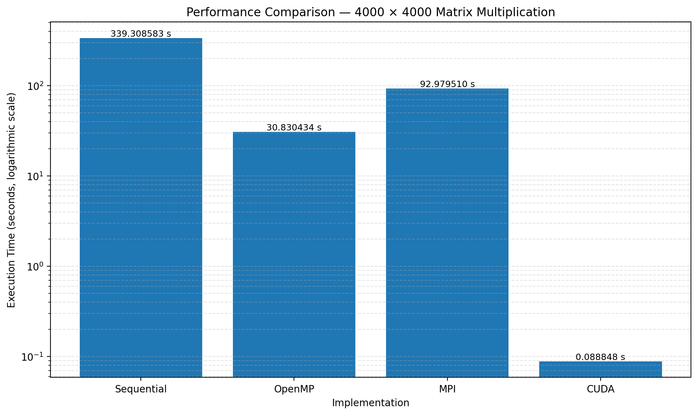

# Experiment 1 — Analysis of Performance for Matrix Multiplication

## 1. Experiment Title

**Analysis of Performance for Matrix Multiplication**

---

## 2. Aim

To implement and analyze the performance of matrix multiplication using four different parallel computing approaches:

1. **Sequential**
2. **OpenMP**
3. **MPI**
4. **CUDA**

The same matrix multiplication problem is evaluated using a matrix size of:

**4000 × 4000**

The performance of each implementation is compared using its measured execution time.

---

## 3. Problem Statement

Given two matrices:

- Matrix A: 4000 × 4000
- Matrix B: 4000 × 4000

the objective is to calculate:

$$
C = A \times B
$$

where:

$$
C[i][j] = \sum_{k=0}^{N-1} A[i][k] \times B[k][j]
$$

For this experiment:

$$
N = 4000
$$

Matrices A and B are initialized with `1.0`.

Therefore:

```text
Expected C[0][0] = 4000.00
```

---

# 4. Sequential Matrix Multiplication

## Execution Model

The sequential implementation performs matrix multiplication using the conventional three nested loops.

The computation is performed by a single CPU execution path without explicit parallelization.

## Result

```text
Sequential Matrix Multiplication Completed
Matrix Size = 4000 x 4000
Execution Time = 339.308583 seconds
Verification C[0][0] = 4000.00
```

### Measured Performance

| Parameter | Result |
|---|---:|
| Matrix Size | 4000 × 4000 |
| Execution Time | **339.308583 s** |
| Verification | **4000.00** |
| Status | **PASSED** |

The sequential implementation is used as the **baseline** for calculating the relative speedup of the other implementations.

---

# 5. OpenMP Matrix Multiplication

## Execution Model

OpenMP uses the shared-memory parallel programming model. The matrix multiplication is divided among multiple CPU threads so that independent portions of the computation can execute concurrently.

## Result

```text
OpenMP Matrix Multiplication Completed
Matrix Size = 4000 x 4000
Number of Threads = 8
Execution Time = 30.830434 seconds
Verification C[0][0] = 4000.00
```

### Measured Performance

| Parameter | Result |
|---|---:|
| Matrix Size | 4000 × 4000 |
| Number of Threads | 8 |
| Execution Time | **30.830434 s** |
| Verification | **4000.00** |
| Status | **PASSED** |

### Speedup over Sequential

$$
Speedup_{OpenMP} =
\frac{T_{Sequential}}{T_{OpenMP}}
=
\frac{results["Sequential"]:.6f}{results["OpenMP"]:.6f}
=
11.01\times
$$

---

# 6. MPI Matrix Multiplication

## Execution Model

MPI uses the distributed-memory programming model. The matrix multiplication workload is distributed among multiple MPI processes.

For the experiment, **4 MPI processes** are used.

The MPI implementation distributes portions of the matrix computation among the processes and combines the partial results.

## Result

```text
MPI Matrix Multiplication Completed
Matrix Size = 4000 x 4000
Number of MPI Processes = 4
Execution Time = 92.979510 seconds
Verification C[0][0] = 4000.00
```

### Measured Performance

| Parameter | Result |
|---|---:|
| Matrix Size | 4000 × 4000 |
| MPI Processes | 4 |
| Execution Time | **92.979510 s** |
| Verification | **4000.00** |
| Status | **PASSED** |

### Speedup over Sequential

$$
Speedup_{MPI} =
\frac{T_{Sequential}}{T_{MPI}}
=
\frac{results["Sequential"]:.6f}{results["MPI"]:.6f}
=
3.65\times
$$

MPI also introduces communication and synchronization overhead because the computation is distributed between separate processes.

---

# 7. CUDA Matrix Multiplication

## Execution Model

CUDA executes the matrix multiplication on the NVIDIA GPU.

Each CUDA thread is responsible for calculating an element of the output matrix. A 2D grid of CUDA blocks is used.

### CUDA Configuration

- GPU: **NVIDIA GeForce RTX 5060 Ti**
- Compute Capability: **12.0**
- Global Memory: **15.93 GB**
- Matrix Size: **4000 × 4000**
- Grid Size: **250 × 250 blocks**
- Block Size: **16 × 16 threads**
- Threads per Block: **256**
- Logical Threads: **16,000,000**

## Result

```text
CUDA Matrix Multiplication
===========================
GPU = NVIDIA GeForce RTX 5060 Ti
Compute Capability = 12.0
Global Memory = 15.93 GB
Matrix Size = 4000 x 4000

Grid Size = 250 x 250 blocks
Block Size = 16 x 16 threads
Threads per Block = 256
Logical Threads = 16000000

Kernel Execution Time = 0.088848 seconds
Total CUDA Phase Time = 0.118994 seconds
Verification C[0][0] = 4000.00
Verification Status = PASSED
```

### Measured Performance

| Parameter | Result |
|---|---:|
| GPU | NVIDIA GeForce RTX 5060 Ti |
| Compute Capability | 12.0 |
| Global Memory | 15.93 GB |
| Matrix Size | 4000 × 4000 |
| Grid Size | 250 × 250 blocks |
| Block Size | 16 × 16 threads |
| Threads per Block | 256 |
| Logical Threads | 16,000,000 |
| Kernel Execution Time | **0.088848 s** |
| Total CUDA Phase Time | **0.118994 s** |
| Verification | **4000.00** |
| Status | **PASSED** |

### CUDA Speedup over Sequential

Using the measured **kernel execution time**:

$$
Speedup_{CUDA} =
\frac{T_{Sequential}}{T_{CUDA,Kernel}}
=
\frac{results["Sequential"]:.6f}{results["CUDA"]:.6f}
=
3818.98\times
$$

---

# 8. Overall Performance Comparison

## Execution Time

| Rank by execution time | Implementation | Execution Time |
|---:|---|---:|
| 1 | CUDA | **0.088848 s** |
| 2 | OpenMP | **30.830434 s** |
| 3 | MPI | **92.979510 s** |
| 4 | Sequential | **339.308583 s** |

> The ordering above is based only on the measured execution times for this 4000 × 4000 experiment.

## Speedup Relative to Sequential

| Implementation | Execution Time | Speedup |
|---|---:|---:|
| Sequential | 339.308583 s | 1.00× |
| OpenMP | 30.830434 s | **11.01×** |
| MPI | 92.979510 s | **3.65×** |
| CUDA | 0.088848 s | **3818.98×** |

---

# 9. Performance Analysis Graph

The following graph compares the measured execution times of all four implementations.



### Interpretation

- **Sequential** provides the baseline execution time of **339.308583 seconds**.
- **OpenMP** reduces the execution time to **30.830434 seconds** by using multiple CPU threads.
- **MPI** completes the computation in **92.979510 seconds** using 4 processes. Its performance includes the overhead associated with distributed processing and communication.
- **CUDA** has a measured kernel execution time of **0.088848 seconds** on the NVIDIA GeForce RTX 5060 Ti. The total CUDA phase time is **0.118994 seconds**.
- The CUDA result demonstrates the large amount of parallelism available on the GPU for this matrix multiplication workload.

Because the execution times differ by several orders of magnitude, the comparison graph uses a **logarithmic Y-axis** so that all four measurements can be clearly visualized.

---

# 10. Verification

All four implementations use the same mathematical problem and expected output.

Since:

```text
A[i][k] = 1.0
B[k][j] = 1.0
N = 4000
```

the expected result is:

```text
C[0][0] = 4000.00
```

The recorded implementations produced:

| Implementation | Verification |
|---|---:|
| Sequential | **4000.00** |
| OpenMP | **4000.00** |
| MPI | **4000.00** |
| CUDA | **4000.00 — PASSED** |

---

# 11. Conclusion

The experiment demonstrates four different approaches for performing the same **4000 × 4000 matrix multiplication**:

- **Sequential:** Single CPU execution path.
- **OpenMP:** Shared-memory CPU parallelism using multiple threads.
- **MPI:** Distributed-memory parallelism using multiple processes.
- **CUDA:** GPU-based parallel execution using thousands of logical threads.

The measured execution times show how the same computational problem behaves under different parallel programming models.

The experiment successfully verifies the matrix multiplication result as:

```text
C[0][0] = 4000.00
```

for the implementations documented above.
